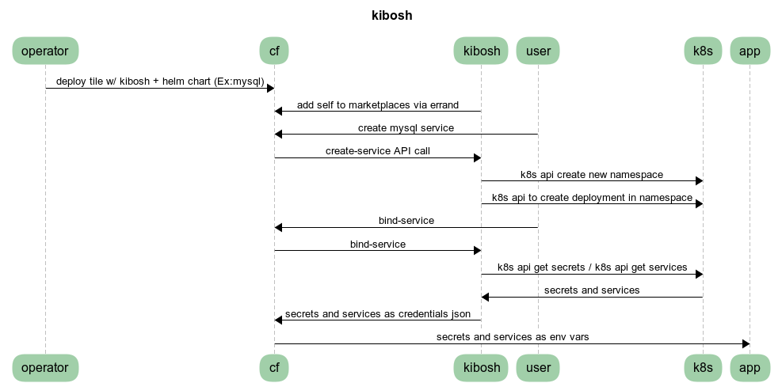

# Kibosh

A generic broker bridging the gap between Kubernetes and CF brokered services.


We BOSH so you don't have to!

## Charts

In order to successfully pull private images, we're imposing some requirements
on the `values.yaml` file structure

* Single image charts should use this structure:
    ```yaml
    ---
    image: "my-image"
    imageTag: "5.7.14"
    ```
* Multi-image charts shoud use this structure:
    ```yaml
    ---
    images:
      thing1:
        image: "my-first-image"
        imageTag: "5.7.14"
      thing2:
        image: "my-second-image"
        imageTag: "1.2.3"
    ```
* Plans
    Kibosh requires that helm chart has additional file that describes plan in plans.yaml at root level
    ```yaml
    - name: "small"
      description: "default (small) plan for mysql"
      file: "small.yaml"
    - name: "medium"
      description: "medium sized plan for mysql"
      file: "medium.yaml"
    ```
    File is a filename that exists in the `plans` subdirectory of the chart
    Name should be lower alpha, numeric, `.`, or `-` 
    Values `values.yaml` sets the defaults and plans only need override values 

### Private registries
When the environment settings for a private registry are present (`REG_SERVER`, `REG_USER`, `REG_PASS`), 
then Kibosh will transform images to pull them from the private registry. It assumes
the image is already present (see the Kibosh deployment). It will patch
the default service account in the instance namespaces to add in the registry credentials.

Be sure that `REG_SERVER` contains any required path information. For example, in gcp `gcr.io/my-project-name`

## Dev
#### Setup
Grab a newish version of Go (we used 1.9) 

Install Go depenencies
```bash
go get -u github.com/onsi/ginkgo/ginkgo
go get -u github.com/onsi/gomega
go get -u github.com/maxbrunsfeld/counterfeiter
go get -u github.com/golang/dep/cmd/dep
```

#### Run
Run `make bootstrap` from a clean checkout to setup initial dependencies. This will restore
the locked dependency set specified by `Gopkg.toml` (we're no longer checking in `vendor`).

Copy `local_dev.sh.template` to `local_dev.sh` (which is in `.gitignore`) and 
configure the values (`cluster.certificate-authority-data`, `cluster.server`, and `user.token`)
for a working cluster (minikube instructions below). Then run:

```bash
./local_dev.sh
```

#### Minikube
To set things up in a way that authentication is done the same way as against PKS, run 
```bash
./dev/minikube_auth.sh
```

Which creates a service account with `cluster-admin` and output the token.

For `certificate-authority-data`, encode the minikube certificate:
```bash
cat ~/.minikube/ca.crt | base64
```

#### Test
```bash
make test
```

Instructions to manually deploy and verify catalog:
1) Build the linux binary
    ```bash
    make linux
    ```
1) Create a directory and put the kibosh executable into it. 
    ```
    mkdir kibosh-example
    cp ~/go/src/github.com/cf-platform-eng/kibosh/kibosh.linux kibosh-example/kibosh.linux
    ```
1) Create a Manifest.yml file as shown below in that directory.
   Get cluster information for kube config file. For `CA_DATA` - `base64 --decode` what comes back from PKS 
    ```
    cat > manifest.yml
    ---
    applications:
    - name: kibosh_manual
      buildpack: binary_buildpack
      command: ./kibosh.linux
      env:
        SECURITY_USER_NAME: username
        SECURITY_USER_PASSWORD: password
        SERVICE_ID: f448fdea-25b8-41aa-aed4-539d8ace5e32
        HELM_CHART_DIR: charts
        CA_DATA: |
           -----BEGIN CERTIFICATE-----
           ...
           -----END CERTIFICATE-----
        SERVER: https://127.0.0.1
        TOKEN: bXktdG9rZW4=
    ```
1) Create a helm chart in that directory.

   That helm chart could like like the example-chart in this project, 
   or could be one of these: https://github.com/kubernetes/charts.  The `HELM_CHART_DIR`
   environment variable in the Manifest.yml file should point to the sub-directory 
   in which you put it. 
   
1) Push the kibosh application (with its helm chart subdirectory) into CF
   ```
   cf push
   ```
1) Validate the data that the catalog endpoint provides
    ```
    curl -k https://example.com/v2/catalog -u 'username:password'
    ```
    The username/password match the manifest's environment variables above.

1) Put the application into the CF Marketplace. 
    ```
    cf create-service-broker kibosh-broker username password https://example.com
    cf enable-service-access myexample_chart
    cf service-brokers
    cf service-access
    ```

1) Create an instance of the helm application from the marketplace. 
    ```
    cf create-service myexample_chart default myexample_instance
    helm list
    cf services
    cf service myexample_instance
    ```
1) Create a service key to bind to the service instance. 
    ```
    cf create-service-key myexample_instance myexample_instance_servicekey
    ```

### ci
* https://concourse.cfplatformeng.com/teams/main/pipelines/kibosh

#### Dependency vendoring

To add a dependency:
```bash
dep ensure -add github.com/pkg/errors
```

To update a dependency:
```bash
dep ensure -update github.com/pkg/errors
```

Dependency vendoring wrt to helm & k8s is trickier. `dep` isn't able to build the
tree without significant help. The `Gopkg.tml` has several overrides needed to get everything
to compile (which work in conjunction with `setup-apimmachinery.sh`).

Updating to a new version of helm/k8s will probably require re-visiting the override & constraint
matrix built. Useful inputs into this process are:
* The k8s Godeps
    - https://github.com/kubernetes/kubernetes/blob/master/Godeps/Godeps.json
* Helm's Glide dependencies and dependency lock file
    - https://github.com/kubernetes/helm/blob/master/glide.yaml
    - https://github.com/kubernetes/helm/blob/master/glide.lock

Also run the make target `cleandep` to wipe out the lock file an any local state when upgrading
helm/k8s, to make sure it can be rebuilt cleanly from the specified constraints.

More dep links:
* Common dep commands: https://golang.github.io/dep/docs/daily-dep.html
* `Gopks.toml` details: https://github.com/golang/dep/blob/master/docs/Gopkg.toml.md

## Notes

Inline-style: 


Diagram source https://www.websequencediagrams.com/ + 
```text
object operator user cf generic_broker k8s app
operator->cf: deploy tile w/ generic_broker+elastic search configured
generic_broker->k8s: create odb kubo cluster
generic_broker->cf: add self to marketplaces (errand?)
user->cf: create elastic search service
cf->generic_broker: create-service API call
generic_broker-> k8s: kubectl create new namespace
generic_broker-> k8s: kubectl to create deployment in namespace
user->cf: bind-service
cf->generic_broker: bind-service
generic_broker-> k8s: kubectl get secrets / kubectl get services
k8s->generic_broker: secrets and services
generic_broker->cf: secrets and services in cf format
cf->app: secrets and services as env vars
```

