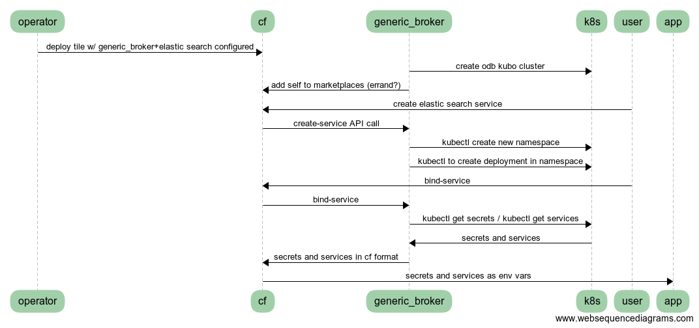

# pks-generic-broker

A generic broker bridging the gap between Kubernetes and CF brokered services.

## Dev
#### Setup
Install Go depenencies
```bash
go get github.com/onsi/ginkgo/ginkgo
go get github.com/onsi/gomega
go get github.com/maxbrunsfeld/counterfeiter
```

#### Dependency vendoring
```bash
govendor add +external
```

To change dependencies, see [govendor](https://github.com/kardianos/govendor) docs for specific commands.

(Tried `dep`, but it added 10s of megabytes of golang.org/x/... to vendor)

#### Test
```bash
make test
```

#### Run
```bash
make run
```

### ci
* https://concourse.cfplatformeng.com/teams/main/pipelines/pks-generic-broker

## Notes

Inline-style: 


Diagram source https://www.websequencediagrams.com/ + 
```text
object operator user cf generic_broker k8s app
operator->cf: deploy tile w/ generic_broker+elastic search configured
generic_broker->k8s: create odb kubo cluster
generic_broker->cf: add self to marketplaces (errand?)
user->cf: create elastic search service
cf->generic_broker: create-service API call
generic_broker-> k8s: kubectl create new namespace
generic_broker-> k8s: kubectl to create deployment in namespace
user->cf: bind-service
cf->generic_broker: bind-service
generic_broker-> k8s: kubectl get secrets / kubectl get services
k8s->generic_broker: secrets and services
generic_broker->cf: secrets and services in cf format
cf->app: secrets and services as env vars
```
